<h1 name="content" align="center"><a href=""> </a> MSSQL</h1>
<p align="center"> 
  <a href="#-lab1"></a>
  <a href="#-lab2"></a>
  <a href="#-lab3"></a>
  <a href="#-lab4"></a>
    <a href="#-lab6"></a>
</p>
<h3 align="center"> <a href="#client"></a> 
  Вариант 15. Гостиница
  
  Список номеров: вместимость, комфортность, этаж, цена.
  Список клиентов: ФИО, паспорт, пол.
  Информация о сдаче номеров: дата заселения, срок поселения, фактическая дата освобождения, предварительная стоимость проживания.
  Информация о бронировании номеров: дата предполагаемого заселения, срок поселения, предварительная стоимость проживания.
  
  Реализовать:
  - Поиск свободных номеров по введенным критериям (Комфортность, дата заезда, срок поселения);
  - подсчет стоимости проживания при выезде клиента;
  - бронирование номера;
  - поиск постоянных клиентов (заселявшихся более 1 раза);
  - поиск клиентов с максимальным сроком проживания
</h3>

#  Lab1
[Назад](#content)
<h3 align="center">
  <a href="#client"></a>
</h3>

<div>
  <p><b>Задание:</b> разработать ER-модель данной предметной области: выделить сущности, их атрибуты, связи между сущностями.</p>

  <p><b>Для каждой сущности указать:</b></p>
  <ol type="1">
    <li>Имя сущности.</li>
    <li>Атрибут (или набор атрибутов), являющийся первичным ключом.</li>
    <li>Список остальных атрибутов.</li>
  </ol>

  <p><b>Для каждого атрибута указать:</b></p>
  <ol type="1">
    <li>Тип.</li>
    <li>Ограничения.</li>
    <li>Может ли он быть пустым.</li>
    <li>Является ли он первичным ключом.</li>
  </ol>

  <p><b>Для каждой связи между сущностями указать:</b></p>
  <ol type="1">
    <li>Тип связи (1:1, 1:M, M:N).</li>
    <li>Обязательность.</li>
  </ol>

  <p>ER-модель должна быть представлена в виде ER-диаграммы (картинка).</p>
  <p>По имеющейся ER-модели создать реляционную модель данных и отобразить её в виде списка сущностей с их атрибутами и типами атрибутов.  
  Для атрибутов указать, являются ли они первичными или внешними ключами.</p>


  <h4>№1. ER-модель</h4>
  

  <h4>№1.1. Реляционная модель</h4>
  
</div>

#  Lab2
[Назад](#content)
<h3 align="center">
  <a href="#client"></a>
</h3>

<div>
  <p><b>Задание:</b> в соответствии с реляционной моделью данных, разработанной в Лаб. №1, создать реляционную БД на учебном сервере БД.</p>

  <p><b>Необходимо:</b></p>
  <ol type="1">
    <li>Создать таблицы, определить первичные ключи и иные ограничения.</li>
    <li>Определить связи между таблицами.</li>
    <li>Создать диаграмму.</li>
    <li>Заполнить все таблицы адекватной информацией (не меньше 10 записей в каждой таблице, включая примеры для связей типа 1:M).</li>
  </ol>
</div>


## №2. Создание таблиц

```
CREATE TABLE Клиент (
    ID INT PRIMARY KEY IDENTITY,
    ФИО NVARCHAR(150) NOT NULL,
    Паспортные_данные CHAR(15) UNIQUE NOT NULL,
    Пол CHAR(1) CHECK (Пол IN ('М', 'Ж')) NOT NULL
);

CREATE TABLE Бронирование (
    ID INT PRIMARY KEY IDENTITY,
    Дата_создания DATE NOT NULL DEFAULT GETDATE(),
    Статус NVARCHAR(20) NOT NULL CHECK (Статус IN ('создана','отменена','завершена')),
    Дата_последнего_изменения DATETIME NOT NULL DEFAULT GETDATE(),
    Дата_предположительного_заселения DATE NOT NULL,
    Предварительная_стоимость DECIMAL(10,2) NOT NULL CHECK (Предварительная_стоимость > 0),
    Клиент_ID INT NOT NULL FOREIGN KEY REFERENCES Клиент(ID)
);

CREATE TABLE Номер (
    ID INT PRIMARY KEY IDENTITY,
    Вместимость INT NOT NULL CHECK (Вместимость > 0),
    Этаж INT NOT NULL,
    Комфортность NVARCHAR(15) NOT NULL,
    Цена_сутки DECIMAL(10,2) NOT NULL CHECK (Цена_сутки > 0)
);

CREATE TABLE Номер_Бронирование (
    Номер_ID INT NOT NULL FOREIGN KEY REFERENCES Номер(ID),
    Бронь_ID INT NOT NULL FOREIGN KEY REFERENCES Бронирование(ID),
    PRIMARY KEY (Номер_ID, Бронь_ID)
);

CREATE TABLE Заселение (
    ID INT PRIMARY KEY IDENTITY,
    Предварительная_стоимость DECIMAL(10,2) CHECK (Предварительная_стоимость > 0),
    Фактическая_дата_выезда DATE NULL,
    Итоговая_стоимость DECIMAL(10,2) CHECK (Итоговая_стоимость > 0),
    Дата_заселения DATE NULL,
    Клиент_ID INT NOT NULL FOREIGN KEY REFERENCES Клиент(ID)
);

CREATE TABLE Заселение_Номер (
    Заселение_ID INT NOT NULL FOREIGN KEY REFERENCES Заселение(ID),
    Номер_ID INT NOT NULL FOREIGN KEY REFERENCES Номер(ID),
    PRIMARY KEY (Заселение_ID, Номер_ID)
);

CREATE TABLE Услуга (
    ID INT PRIMARY KEY IDENTITY,
    Название NVARCHAR(50) NOT NULL,
    Цена DECIMAL(10,2) NOT NULL CHECK (Цена >= 0)
);

CREATE TABLE Заселение_Услуга (
    Заселение_ID INT NOT NULL FOREIGN KEY REFERENCES Заселение(ID),
    Услуга_ID INT NOT NULL FOREIGN KEY REFERENCES Услуга(ID),
    PRIMARY KEY (Заселение_ID, Услуга_ID)
);

CREATE TABLE Оплата (
    ID INT PRIMARY KEY IDENTITY,
    Дата_оплаты DATE NOT NULL,
    Сумма DECIMAL(10,2) NOT NULL CHECK (Сумма > 0),
    Способ_оплаты NVARCHAR(30) NOT NULL,
    Заселение_ID INT NOT NULL FOREIGN KEY REFERENCES Заселение(ID)
);

INSERT INTO Клиент (ФИО, Паспортные_данные, Пол) VALUES
('Шипицын Денис Александрович','1118000001', 'М'),
('Немтинов Никита Сергеевич','1118000002', 'М'),
('Сидорова Анна Павловна','1118000003', 'Ж'),
('Кузнецов Алексей Николаевич','1118000004', 'М'),
('Соколова Мария Сергеевна','1118000005', 'Ж'),
('Морозов Дмитрий Викторович','1118000006', 'М'),
('Васильева Елена Андреевна','1118000007', 'Ж'),
('Попов Николай Егорович','1118000008', 'М'),
('Козлова Татьяна Игоревна','1118000009', 'Ж'),
('Орлов Артём Константинович','1118000011', 'М'),
('Федорова Валентина Петровна','1118000012', 'Ж'),
('Новиков Сергей Александрович','1118000013', 'М'), --12
('Сергиевский Никита Романович','1118000014', 'М'), --13
('Минина Анна Евгеньевна','1118000015', 'Ж'), --14
('Сладкая Елена Викторовна','1118000016', 'Ж'), --15
('Горькая Надежда Павловна','1118000017', 'Ж'); --16

INSERT INTO Номер (Вместимость, Этаж, Комфортность, Цена_сутки) VALUES
(1, 1, 'Стандарт', 1500.00), --1 +
(2, 1, 'Стандарт', 2000.00), --2 +
(2, 2, 'Комфорт', 2800.00), --3 +
(3, 2, 'Комфорт', 3200.00), --4 +
(1, 3, 'Люкс', 5000.00), --5 +
(2, 3, 'Люкс', 6500.00), --6 +
(4, 4, 'Апартаменты', 9000.00), --7 +
(1, 4, 'Стандарт', 1700.00), --8
(2, 5, 'Комфорт', 3000.00), --9 +
(3, 5, 'Люкс', 7000.00), --10 +
(2, 6, 'Комфорт+', 4500.00), --11 +
(2, 5, 'Комфорт', 3000.00), --12 +
(4, 7, 'Апартаменты', 12000.00), --13
(1, 7, 'Апартаменты', 10000.00), --14 +
(4, 6, 'Комфорт+', 5500.00), --15
(2, 6, 'Комфорт+', 4500.00), --16
(1, 3, 'Стандарт', 1700.00); --17

INSERT INTO Бронирование (Статус, Дата_предположительного_заселения, Предварительная_стоимость, клиент_id) VALUES
('завершена', '2025-09-20', 1500.00 * 2, 1), --1
('создана', '2025-09-26', 7000.00 * 1, 2), --2
('завершена', '2025-09-10', 5000.00 * 5, 3), --3
('отменена', '2025-09-27', 3000.00 * 1, 4), --4
('создана', '2025-09-24', 4500.00 * 2, 5), --5
('завершена', '2025-08-01', 2000.00 * 10, 6), --6
('завершена', '2025-08-05', 3200.00 * 1, 7), --7
('завершена', '2025-09-15', 3000.00 * 7, 8), --8
('создана', '2025-09-20', 9000.00 * 10, 9), --9
('завершена', '2025-09-02', 6500.00 * 2, 10), --10
('завершена', '2025-09-19', 2800.00 * 1, 11), --11
('завершена', '2025-10-01', 10000.00 * 4, 12), --12
('завершена', '2025-10-10', 4500.00 * 1, 15), --13
('завершена', '2025-10-12', 2000.00 * 4, 6), --14
('завершена', '2025-10-12', 5000.00 * 2, 3), --15
('создана', '2025-11-04', 1700.00 * 4, 16); --16

INSERT INTO Номер_Бронирование (номер_id, бронь_id) VALUES
(1,1),
(10,2),
(5,3),
(12,4),
(11,5),
(2,6),
(4,7),
(9,8),
(7,9),
(6,10),
(3,11),
(14,12),
(16,13),
(2, 14),
(5,15),
(17, 16);

INSERT INTO Заселение (Предварительная_стоимость, Фактическая_дата_выезда, Итоговая_стоимость, Дата_заселения, клиент_id) VALUES
(3000.00, '2025-09-22', 3000.00, '2025-09-20', 1), --1
(7000.00, NULL, NULL, NULL, 2), --2
(25000.00, '2025-09-15', 25000.00, '2025-09-10', 3), --3
(9000.00, NULL, NULL, '2025-09-24', 5), --4
(20000.00, '2025-08-11', 20000.00, '2025-08-01', 6), --5
(3200.00, '2025-08-06', 3200.00, '2025-08-05', 7), --6
(21000.00, '2025-09-22', 21000.00, '2025-09-15', 8), --7
(90000.00, NULL, NULL, '2025-09-20', 9), --8
(13000.00, '2025-09-04', 13000.00, '2025-09-02', 10), --9
(2800.00, '2025-09-20', 2800.00, '2025-09-19', 11), --10
(40000.00, '2025-10-04', 30000.00, '2025-10-01', 12), --11
(8000.00, '2025-10-16', 8000.00, '2025-10-12', 6), --12
(10000.00, '2025-10-14', 10000.00, '2025-10-12', 3); --13

INSERT INTO Заселение_Номер (заселение_id, номер_id) VALUES
(1,1),
(2,10),
(3,5),
(4,11),
(5,2),
(6,4),
(7,9),
(8,7),
(9,6),
(10,3),
(11,14),
(12,2),
(13,5);

INSERT INTO Услуга (Название, Цена) VALUES
('Завтрак', 500.00), --1
('Ужин', 1000.00), --2
('Трансфер', 1500.00), --3
('Сауна', 2000.00), --4
('Бассейн', 1200.00), --5
('Парковка', 700.00), --6
('Wi-Fi', 300.00), --7
('Мини-бар', 800.00), --8
('Спортзал', 1100.00), --9
('Прачечная', 900.00); --10

-- заказанное
INSERT INTO Заселение_Услуга (заселение_id, услуга_id) VALUES
(1,1),
(1,2),
(2,9),
(3,8),
(3,4),
(4,2),
(5,1),
(5,2),
(5,3),
(7,8),
(7,4),
(9,1);

-- оплаты: завершенные оплачены полностью в последний день, у текущих оплата без услуг в любой день
INSERT INTO Оплата (Дата_оплаты, Сумма, Способ_оплаты, заселение_id) VALUES
('2025-09-22', 4500.00, 'Карта', 1),
('2025-09-24', 8100.00, 'Карта', 2),
('2025-09-15', 27800.00, 'Наличные', 3),
('2025-09-24', 9000.00, 'Карта',4),
('2025-08-11', 23000.00, 'Карта', 5),
('2025-08-06', 3200.00, 'Карта', 6),
('2025-09-22', 23800.00, 'Карта', 7),
('2025-09-20', 90000.00, 'Карта', 8),
('2025-09-04', 13500.00, 'Карта', 9),
('2025-09-20', 2800.00, 'Карта', 10),
('2025-10-04', 30000.00, 'Карта', 11),
('2025-10-16', 8000.00, 'Наличные', 12),
('2025-10-14', 10000.00, 'Карта', 13);

--SELECT * FROM Клиент
--SELECT * FROM Номер
--SELECT * FROM Бронирование
--SELECT * FROM Номер_Бронирование
--SELECT * FROM Заселение
--SELECT * FROM Заселение_Номер
--SELECT * FROM Услуга
--SELECT * FROM Заселение_Услуга
--SELECT * FROM Оплата
```

## №2.1. Диаграмма


## №2.2. Заполненные таблицы
### Клиент

### Номер

### Бронирование

### Номер_Бронирование

### Заселение

### Заселение_Номер

### Услуга

### Заселение_Услуга

### Оплата


#  Lab3
[Назад](#content)
<h3 align="center">
  <a href="#client"></a>
</h3>

<div>
  <h4>Часть 1</h4>
  <p><b>Цель:</b> изучить конструкции языка SQL для манипулирования данными в СУБД MSSQL.</p>
  <p><b>Задания и краткое описание работы:</b></p>
  <ol>
    <li>Выборка из одной таблицы.
      <ol type="1">
        <li>Выбрать из произвольной таблицы данные и отсортировать их по двум произвольным имеющимся в таблице признакам (разные направления сортировки).</li>
        <li>Выбрать из произвольной таблицы те записи, которые удовлетворяют условию отбора (where). Привести 2-3 запроса.</li>
        <li>Привести примеры 2-3 запросов с использованием агрегатных функций (count, max, sum и др.) с группировкой и без группировки.</li>
        <li>Привести примеры подведения подытога с использованием GROUP BY [ALL] [CUBE | ROLLUP] (2-3 запроса). В ROLLUP и CUBE использовать не менее 2-х столбцов.</li>
        <li>Выбрать из таблиц информацию об объектах, в названиях которых нет заданной последовательности букв (LIKE).</li>
      </ol>
    </li>
    <li>Выборка из нескольких таблиц.
      <ol type="1">
        <li>Вывести информацию подчиненной (дочерней) таблицы, заменяя коды (значения внешних ключей) соответствующими символьными значениями из родительских таблиц. Привести 2-3 запроса с использованием классического подхода соединения таблиц (where).</li>
        <li>Реализовать запросы пункта 2.1 через внутреннее соединение inner join.</li>
        <li>Левое внешнее соединение left join. Привести 2-3 запроса.</li>
        <li>Правое внешнее соединение right join. Привести 2-3 запроса.</li>
        <li>Привести примеры 2-3 запросов с использованием агрегатных функций и группировки.</li>
        <li>Привести примеры 2-3 запросов с использованием группировки и условия отбора групп (Having).</li>
        <li>Привести примеры 3-4 вложенных (соотнесенных, с использованием IN, EXISTS) запросов.</li>
      </ol>
    </li>
    <li>Представления
      <ol type="1">
        <li>На основе любых запросов из п. 2 создать два представления (VIEW).</li>
        <li>Привести примеры использования общетабличных выражений (CTE) (2-3 запроса).</li>
      </ol>
    </li>
    <li>Функции ранжирования
      <ol type="1">
        <li>Привести примеры 3-4 запросов с использованием ROW_NUMBER, RANK, DENSE_RANK (с PARTITION BY и без).</li>
      </ol>
    </li>
    <li>Объединение, пересечение, разность
      <ol type="1">
        <li>Привести примеры 3-4 запросов с использованием UNION / UNION ALL, EXCEPT, INTERSECT. Данные в одном из запросов отсортируйте по произвольному признаку.</li>
      </ol>
    </li>
    <li>Использование CASE, PIVOT и UNPIVOT
      <ol type="1">
        <li>Привести примеры получения сводных (итоговых) таблиц с использованием CASE.</li>
        <li>Привести примеры получения сводных (итоговых) таблиц с использованием PIVOT и UNPIVOT.</li>
      </ol>
    </li>
  </ol>

  <p><b>Обязательными к выполнению</b> являются запросы, приведенные ниже (смотри свой вариант).</p>
  <p>Отчет по лабораторной работе предоставляется в виде документа <i>(Фамилия_Группа.docx)</i>.  
  В этом документе по каждому заданию необходимо представить: условие запроса, текст SQL-запроса, скрин-копию результата выполнения запроса.</p>

  <h4>Часть 2</h4>
  <p><b>Составить следующие запросы:</b></p>
  <ol type="a">
    <li>Найти номера, не занятые и не забронированные на данный момент.</li>
    <li>Найти клиентов, выехавших из номера раньше срока, указанного в договоре.</li>
    <li>Найти номера, которые ни разу не сдавались с начала текущего года.</li>
    <li>Найти клиентов, забронировавших номер, но так и не въехавших в него.</li>
    <li>Среди всех клиентов, наиболее часто пользующихся услугами гостиницы, найти клиентов с максимальным сроком проживания.</li>
  </ol>
</div>
<a href="https://github.com/shidendi/databases_Shipitsyn_PMI-32_15variant/raw/main/Doc/Шипицын_ПМИ-32БО.docx" target="_blank">Лабораторная №3</a>


#  Lab4
[Назад](#content)
<h3 align="center">
  <a href="#client"></a>
</h3>

<div>
  <h4>Создать  4 различных хранимых процедуры:</h4>
  <ol type="a">
    <li><b>Процедура без параметров, формирующая список номеров (номер, комфортность, цена), которые никогда не бронировались и не заселялись.</li>
<pre><code>
CREATE PROCEDURE dbo.Номера_НеИспользовались
AS
BEGIN
    -- хранение рез-ов
    DECLARE @Номер_ID INT, 
            @Комфортность NVARCHAR(15), 
            @Цена_сутки DECIMAL(10,2);
    -- куроср по номерам без брони и заселения
    DECLARE номера_cursor CURSOR FOR
        SELECT n.ID, n.Комфортность, n.Цена_сутки
        FROM Номер n
        WHERE n.ID NOT IN (SELECT Номер_ID FROM Номер_Бронирование)
          AND n.ID NOT IN (SELECT Номер_ID FROM Заселение_Номер);
    -- открыть курсор
    OPEN номера_cursor;
    -- первая запись
    FETCH NEXT FROM номера_cursor INTO @Номер_ID, @Комфортность, @Цена_сутки;
    PRINT 'Список номеров, которые никогда не бронировались и не заселялись:';
    -- циклом по всем строкам из выборки
    WHILE @@FETCH_STATUS = 0
    BEGIN
        PRINT 'Номер ID: ' + CAST(@Номер_ID AS NVARCHAR(10)) +
              ', Комфортность: ' + @Комфортность +
              ', Цена за сутки: ' + CAST(@Цена_сутки AS NVARCHAR(20));
        FETCH NEXT FROM номера_cursor INTO @Номер_ID, @Комфортность, @Цена_сутки;
    END
    -- курсор закрыть и освободить
    CLOSE номера_cursor;
    DEALLOCATE номера_cursor;
END;
GO

EXEC dbo.Номера_НеИспользовались;
</code></pre>
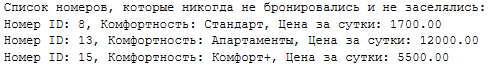
    <li><b> Процедура, на входе получающая критерии поиска номера (комфортность, дата заезда, срок поселения) и формирующая список подходящих номеров с учетом того, что они на этот срок не должны быть заняты или забронированы.</li>
<pre><code>
CREATE PROCEDURE dbo.Поиск_Номеров_По_Критериям
    @Комфортность NVARCHAR(15),
    @Дата_заезда DATE,
    @Срок INT
AS
BEGIN
    DECLARE 
        @Дата_выезда DATE = DATEADD(DAY, @Срок, @Дата_заезда),
        @Номер_ID INT,
        @Свободен BIT;
    -- таблица для хранения результата
    DECLARE @Результат TABLE (
        Номер_ID INT,
        Комфортность NVARCHAR(15),
        Цена_сутки DECIMAL(10,2)
    );
    -- курсор по всем номерам нужной комфортности
    DECLARE cur CURSOR FOR
        SELECT ID
        FROM Номер
        WHERE Комфортность = @Комфортность;
    OPEN cur;
    FETCH NEXT FROM cur INTO @Номер_ID;
    WHILE @@FETCH_STATUS = 0
    BEGIN
        SET @Свободен = 1;  -- номер свободен
        -- проверка не забронирован ли на этот срок
        IF EXISTS (
            SELECT 1
            FROM Номер_Бронирование nb
            JOIN Бронирование b ON nb.Бронь_ID = b.ID
            WHERE nb.Номер_ID = @Номер_ID
              AND b.Статус IN ('создана', 'завершена')
              -- пересечнеие дат
              AND (@Дата_заезда BETWEEN b.Дата_предположительного_заселения AND DATEADD(DAY, @Срок, b.Дата_предположительного_заселения)
                    OR
                    b.Дата_предположительного_заселения BETWEEN @Дата_заезда AND @Дата_выезда)
        )
        BEGIN
            -- если пересеч есть, то занят
            SET @Свободен = 0;
        END
        -- проверка по заселениям
        IF EXISTS (
            SELECT 1
            FROM Заселение_Номер zn
            JOIN Заселение z ON zn.Заселение_ID = z.ID
            WHERE zn.Номер_ID = @Номер_ID
              AND ((z.Фактическая_дата_выезда IS NULL AND z.Дата_заселения <= @Дата_выезда) -- еще живет (без даты выезда)
                    OR
                    -- даты заселения пересекаются с заданным периодом
                    (z.Фактическая_дата_выезда IS NOT NULL AND @Дата_заезда <= z.Фактическая_дата_выезда AND z.Дата_заселения <= @Дата_выезда))
        )
        BEGIN
            -- занят
            SET @Свободен = 0;
        END
        -- свободный в ответ
        IF @Свободен = 1
        BEGIN
            INSERT INTO @Результат (Номер_ID, Комфортность, Цена_сутки)
            SELECT ID, Комфортность, Цена_сутки
            FROM Номер
            WHERE ID = @Номер_ID;
        END
        FETCH NEXT FROM cur INTO @Номер_ID;
    END
    CLOSE cur;
    DEALLOCATE cur;
    SELECT * FROM @Результат;
END;
GO

EXEC dbo.Поиск_Номеров_По_Критериям 
    @Комфортность = 'Комфорт', 
    @Дата_заезда = '2025-11-10', 
    @Срок = 5;
</code></pre>
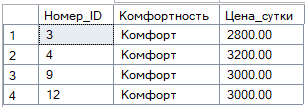
    <li><b> Процедура, на входе получающая ФИО клиента, выходной параметр – дата его последнего заселения.</li>
<pre><code>
 CREATE PROCEDURE dbo.Последнее_Заселение_Клиента
    @ФИО NVARCHAR(150),
    @Последнее_Заселение DATE OUTPUT
AS
BEGIN
    DECLARE 
        @Клиент_ID INT,
        @ТекущаяДата DATE,
        @МаксДата DATE = NULL;
    DECLARE cur CURSOR FOR
        SELECT ID
        FROM Клиент
        WHERE ФИО = @ФИО; -- надо если есть одинаковое фио
    OPEN cur;
    FETCH NEXT FROM cur INTO @Клиент_ID;
    WHILE @@FETCH_STATUS = 0
    BEGIN
        -- дата заселения последняя текущего чела
        SELECT @ТекущаяДата = MAX(Дата_заселения)
        FROM Заселение
        WHERE Клиент_ID = @Клиент_ID;
        -- если есть заселения 
        IF @ТекущаяДата IS NOT NULL
        BEGIN
            IF @МаксДата IS NULL OR @ТекущаяДата > @МаксДата
                SET @МаксДата = @ТекущаяДата; -- бОльшая дата
        END
        FETCH NEXT FROM cur INTO @Клиент_ID;
    END
    CLOSE cur;
    DEALLOCATE cur;
    SET @Последнее_Заселение = @МаксДата;
END;
GO

DECLARE @Дата DATE;

EXEC dbo.Последнее_Заселение_Клиента 
    @ФИО = N'Шипицын Денис Александрович', 
    @Последнее_Заселение = @Дата OUTPUT;

SELECT @Дата AS [Дата последнего заселения];
</code></pre>
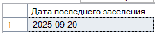
    <li><b> Процедура, вызывающая вложенную процедуру, которая подсчитывает среднюю посещаемость клиентами нашей гостиницы (т.е., сколько раз в среднем каждый клиент пользовался нашими услугами). Главная процедура выводит список клиентов, число посещений которых больше среднего.</li>
<pre><code>
 CREATE PROCEDURE dbo.proc_Средняя_Посещаемость
    @Среднее FLOAT OUTPUT
AS
BEGIN
    SET NOCOUNT ON;

    -- общ число заселен и клиентов
    DECLARE @ВсегоЗаселений INT, @ВсегоКлиентов INT;

    SELECT @ВсегоЗаселений = ISNULL(COUNT(*), 0) FROM Заселение;
    SELECT @ВсегоКлиентов = ISNULL(COUNT(*), 0) FROM Клиент;

    IF @ВсегоКлиентов = 0
        SET @Среднее = 0; 
    -- средуха
    ELSE
        SET @Среднее = CAST(@ВсегоЗаселений AS FLOAT) / @ВсегоКлиентов;
END;
GO

CREATE PROCEDURE dbo.proc_Клиенты_Выше_Среднего
AS
BEGIN
    SET NOCOUNT ON;

    DECLARE @Среднее FLOAT;
    DECLARE @КлиентID INT, @ФИО NVARCHAR(150), @Посещений INT;

    -- влож проц
    EXEC dbo.proc_Средняя_Посещаемость @Среднее OUTPUT;

    PRINT 'Среднее количество посещений клиентов: ' + CAST(@Среднее AS NVARCHAR(20));
    PRINT 'Клиенты, число посещений которых выше среднего:';

    DECLARE cur CURSOR FOR
        SELECT c.ID, c.ФИО, ISNULL(COUNT(z.ID),0) AS Количество_Посещений
        FROM Клиент c
        LEFT JOIN Заселение z ON c.ID = z.Клиент_ID
        GROUP BY c.ID, c.ФИО;

    OPEN cur;
    FETCH NEXT FROM cur INTO @КлиентID, @ФИО, @Посещений;

    WHILE @@FETCH_STATUS = 0
    BEGIN
        -- посещ > среднего
        IF @Посещений > @Среднее
        BEGIN
            PRINT CONCAT(@ФИО, ' — ', @Посещений, ' посещений');
        END;

        FETCH NEXT FROM cur INTO @КлиентID, @ФИО, @Посещений;
    END;

    CLOSE cur;
    DEALLOCATE cur;
END;
GO
EXEC dbo.proc_Клиенты_Выше_Среднего;   
</code></pre>
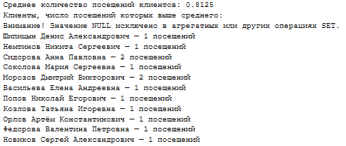
  </ol>

  <h4>3 пользовательские функции:</h4>
  <ol type="a">
    <li><b>Скалярная функция, возвращающая ФИО клиента, прожившего в гостинице наибольшее количество дней в сумме за все посещения. Если их несколько, возвращается клиент с наименьшим ID.</li>
<pre><code>
CREATE FUNCTION dbo.Клиент_МаксимальноеПроживание()
RETURNS NVARCHAR(150)
AS
BEGIN
    DECLARE @ФИО NVARCHAR(150);
    ;WITH Проживания AS (
        SELECT 
            z.Клиент_ID,
            SUM(DATEDIFF(DAY, z.Дата_заселения, z.Фактическая_дата_выезда)) AS Всего_дней
        FROM Заселение z
        WHERE z.Дата_заселения IS NOT NULL
          AND z.Фактическая_дата_выезда IS NOT NULL
        GROUP BY z.Клиент_ID
    ),
    МаксПроживание AS (
        SELECT MAX(Всего_дней) AS Макс_дней
        FROM Проживания
    )
    SELECT TOP 1 @ФИО = k.ФИО
    FROM Проживания p
    JOIN МаксПроживание m ON p.Всего_дней = m.Макс_дней
    JOIN Клиент k ON k.ID = p.Клиент_ID
    ORDER BY k.ID;
    RETURN @ФИО;
END;
GO
SELECT dbo.Клиент_МаксимальноеПроживание() AS Клиент_с_максимальным_проживанием;
</code></pre>
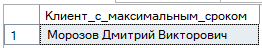
    <li><b>Inline-функция, возвращающая список номеров, забронированных на данный момент, но реально не занятых (клиенты нас «обманули»).</li>
<pre><code>
CREATE FUNCTION dbo.Номера_Обманули()
RETURNS TABLE
AS
RETURN
(
    SELECT DISTINCT 
        n.ID AS Номер_ID,
        n.Комфортность,
        n.Цена_сутки
    FROM Номер n
    JOIN Номер_Бронирование nb ON n.ID = nb.Номер_ID
    JOIN Бронирование b ON b.ID = nb.Бронь_ID
    WHERE 
        b.Статус = 'создана' -- бронь активна
        AND b.Дата_предположительного_заселения <= GETDATE()  -- должны были заехать
        AND n.ID NOT IN (SELECT Номер_ID FROM Заселение_Номер) -- заселения нет
);
GO
SELECT * FROM dbo.Номера_Обманули();
</code></pre>
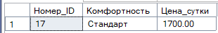
    <li><b>Multi-statement-функция, возвращающая список забронированных номеров, в которые клиенты так и не въехали за весь период брони.</li>
<pre><code>
CREATE FUNCTION dbo.Номера_Без_Заселения()
RETURNS @Результат TABLE (
    Номер_ID INT,
    Комфортность NVARCHAR(15),
    Цена_сутки DECIMAL(10,2)
)
AS
BEGIN
    DECLARE 
        @Номер_ID INT, 
        @Комфортность NVARCHAR(15), 
        @Цена_сутки DECIMAL(10,2);
    -- есть в брони, но без заселения
    DECLARE cur CURSOR FOR
        SELECT DISTINCT n.ID, n.Комфортность, n.Цена_сутки
        FROM Номер n
        JOIN Номер_Бронирование nb ON nb.Номер_ID = n.ID
        JOIN Бронирование b ON b.ID = nb.Бронь_ID
        WHERE b.Статус = 'создана'
          AND n.ID NOT IN (
              SELECT DISTINCT zn.Номер_ID
              FROM Заселение_Номер zn
          );
    OPEN cur;
    FETCH NEXT FROM cur INTO @Номер_ID, @Комфортность, @Цена_сутки;
    WHILE @@FETCH_STATUS = 0
    BEGIN
        INSERT INTO @Результат (Номер_ID, Комфортность, Цена_сутки)
        VALUES (@Номер_ID, @Комфортность, @Цена_сутки);
        FETCH NEXT FROM cur INTO @Номер_ID, @Комфортность, @Цена_сутки;
    END;
    CLOSE cur;
    DEALLOCATE cur;
    RETURN;
END;
GO

SELECT * FROM dbo.Номера_Без_Заселения();
</code></pre>
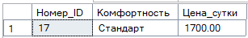
  </ol>

  <h4>Создать  3 триггера:</h4>
  <ol type="a">
    <li><b>Триггер любого типа на добавление брони – если дата заезда больше текущей на 6 месяцев – цена на такую бронь увеличивается на 10%.</li>
<pre><code>
CREATE TRIGGER dbo.trg_Бронирование_Цена
ON Бронирование -- триггер на табл бронь
AFTER INSERT -- триггер должен сработать после инсерта
AS
BEGIN
    DECLARE 
        @ID INT,
        @Дата_предп DATE,
        @СтараяЦена DECIMAL(10,2);
    -- курсор обхода всех вставленных записей
    DECLARE cur CURSOR FOR
        SELECT ID, Дата_предположительного_заселения, Предварительная_стоимость
        FROM inserted;
    OPEN cur;
    FETCH NEXT FROM cur INTO @ID, @Дата_предп, @СтараяЦена;
    WHILE @@FETCH_STATUS = 0
    BEGIN
        -- дата заезда дальше чем через 6 мес
        IF @Дата_предп > DATEADD(MONTH, 6, GETDATE())
        BEGIN
            UPDATE Бронирование
            SET Предварительная_стоимость = ROUND(@СтараяЦена * 1.10, 2)
            WHERE ID = @ID;
        END
        FETCH NEXT FROM cur INTO @ID, @Дата_предп, @СтараяЦена;
    END
    CLOSE cur;
    DEALLOCATE cur;
END;
GO

INSERT INTO Бронирование (Статус, Дата_предположительного_заселения, Предварительная_стоимость, Клиент_ID)
VALUES 
('создана', DATEADD(MONTH, 7, GETDATE()), 5000.00, 1), -- должна подорожать
('создана', DATEADD(MONTH, 3, GETDATE()), 4000.00, 2); -- не должна 

SELECT TOP 2 ID, Дата_предположительного_заселения, Предварительная_стоимость
FROM Бронирование
ORDER BY 
    ID DESC;
</code></pre>
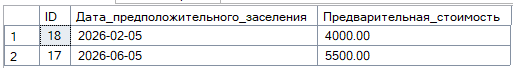
    <li><b>Последующий триггер на изменение фактической даты освобождения – если клиент прожил в гостинице больше, чем было записано в договоре, пересчитать общую стоимость проживания.</li> 
<pre><code>
-- триггер на табл заселен
CREATE TRIGGER dbo.trg_Пересчет_Стоимость_Проживания
ON Заселение
AFTER UPDATE
AS
BEGIN
    -- переменные курсора
    DECLARE 
        @ID INT,
        @Дата_Заселения DATE,
        @Факт_Дата_Выезда DATE,
        @Предварительная_стоимость DECIMAL(10,2), -- стоимость по договору
        @Клиент_ID INT,
        @Номер_ID INT,
        @Цена_сутки DECIMAL(10,2),
        @Дней_Договор INT, -- срок по договору
        @Дней_Факт INT; -- фактич кол-во дней проживания
    -- курсор по всем записям где обновилась фактич дата выезда
    DECLARE cur CURSOR FOR
        SELECT 
            z.ID,
            z.Дата_заселения,
            z.Фактическая_дата_выезда,
            z.Предварительная_стоимость,
            z.Клиент_ID,
            zn.Номер_ID
        FROM inserted i
        JOIN Заселение z ON i.ID = z.ID
        JOIN Заселение_Номер zn ON zn.Заселение_ID = z.ID
        WHERE i.Фактическая_дата_выезда IS NOT NULL;
    OPEN cur;
    FETCH NEXT FROM cur 
    INTO @ID, @Дата_Заселения, @Факт_Дата_Выезда, @Предварительная_стоимость, @Клиент_ID, @Номер_ID;
    WHILE @@FETCH_STATUS = 0
    BEGIN
        -- цена за сутки из номер
        SELECT @Цена_сутки = Цена_сутки
        FROM Номер
        WHERE ID = @Номер_ID;
        -- кол-во дней проживания
        SET @Дней_Факт = DATEDIFF(DAY, @Дата_Заселения, @Факт_Дата_Выезда);
        -- дней по договору
        SET @Дней_Договор = @Предварительная_стоимость / @Цена_сутки;
        -- больше договора - пересчет
        IF @Дней_Факт > @Дней_Договор
        BEGIN
            DECLARE @Новая_Стоимость DECIMAL(10,2);
            SET @Новая_Стоимость = @Дней_Факт * @Цена_сутки;
            UPDATE Заселение
            SET Итоговая_стоимость = @Новая_Стоимость
            WHERE ID = @ID;
        END
        FETCH NEXT FROM cur 
        INTO @ID, @Дата_Заселения, @Факт_Дата_Выезда, 
             @Предварительная_стоимость, @Клиент_ID, @Номер_ID;
    END
    CLOSE cur;
    DEALLOCATE cur;
END;
GO

-- челик дольше прожил
UPDATE Заселение
SET Фактическая_дата_выезда = '2025-09-25'
WHERE ID = 1;

SELECT ID, Дата_заселения, Фактическая_дата_выезда, Итоговая_стоимость
FROM Заселение
WHERE ID = 1;
</code></pre>
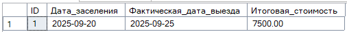
    <li><b>Замещающий триггер на операцию удаления номера из списка номеров – если номер на данный момент занят, то не удаляем его, выводим сообщение о невозможности удаления; если не занят – удаляем его и всю информацию о его сдаче и бронировании</li>
<pre><code>
 CREATE TRIGGER trg_Удаление_Номера
ON Номер
INSTEAD OF DELETE
AS
BEGIN
    SET NOCOUNT ON;
    DECLARE 
        @Номер_ID INT,
        @Занят BIT;
    DECLARE cur CURSOR FOR
        SELECT ID FROM deleted;  -- делетед временная табл с удаленными
    OPEN cur;
    FETCH NEXT FROM cur INTO @Номер_ID;
    WHILE @@FETCH_STATUS = 0
    BEGIN
        -- занят ли номер
        IF EXISTS (
            SELECT 1
            FROM Заселение_Номер zn
            JOIN Заселение z ON zn.Заселение_ID = z.ID
            WHERE zn.Номер_ID = @Номер_ID
              AND (z.Фактическая_дата_выезда IS NULL OR z.Фактическая_дата_выезда > GETDATE())
        )
        BEGIN
            PRINT CONCAT('Номер ID = ', @Номер_ID, ' сейчас занят и не может быть удалён.');
        END
        ELSE
        BEGIN
            PRINT CONCAT('Номер ID = ', @Номер_ID, ' свободен. Удаляем связанные записи...');
            -- удалит услуги типа
            DELETE FROM Заселение_Услуга
            WHERE Заселение_ID IN (
                SELECT Заселение_ID FROM Заселение_Номер WHERE Номер_ID = @Номер_ID
            );
            -- удал оплата
            DELETE FROM Оплата
            WHERE Заселение_ID IN (
                SELECT Заселение_ID FROM Заселение_Номер WHERE Номер_ID = @Номер_ID
            );
            -- удалит засел_номер
            DELETE FROM Заселение_Номер WHERE Номер_ID = @Номер_ID;
            -- удалит засел
            DELETE FROM Заселение
            WHERE ID NOT IN (SELECT Заселение_ID FROM Заселение_Номер);
            -- удалит номер_брон
            DELETE FROM Номер_Бронирование WHERE Номер_ID = @Номер_ID;
            -- удалит брон
            DELETE FROM Бронирование
            WHERE ID NOT IN (SELECT Бронь_ID FROM Номер_Бронирование);
            -- удалит номер
            DELETE FROM Номер WHERE ID = @Номер_ID;
            PRINT CONCAT('Номер ID = ', @Номер_ID, ' и все связанные данные успешно удалены.');
        END;
        FETCH NEXT FROM cur INTO @Номер_ID;
    END;
    CLOSE cur;
    DEALLOCATE cur;
END;
GO
-- свободен
DELETE FROM Номер WHERE ID = 5;

-- занят
DELETE FROM Номер WHERE ID = 7; 
</code></pre>
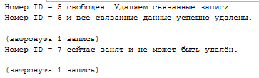
  </ol>

  <p><b>Обязательно предусмотреть обработку НЕСКОЛЬКИХ записей! (там, где необходимо, использовать КУРСОР!)</b>.</p>

</div>

#  Lab6
[Назад](#content)
<h3 align="center">
  <a href="#client"></a>
</h3>

<div>
  <h4>Создание графовых таблиц и работа с ними</h4>
  
  <p><b>Задание 1:</b></p>
  <ol>
    <li>Используйте реляционную БД из лабораторной работы №2.</li>
    <li>Продумайте и создайте графовые таблицы по реляционной БД, заполните графовые таблицы используя данные в реляционных таблицах.</li>
    <li>ЗНапишите запросы из задания 3.2 используя паттерн MATCH.</li>
    <li>Сравните полученные результаты  с  результатами запросов к реляционной модели.</li>
  </ol>
  
  <p><b>Отчет предоставить в виде:</b></p>
  <ul>
    <li>Схема узлов и ребер.</li>
    <li>Скрипт для создания и заполнения графовых таблиц</li>
<pre><code>
-- удалить если есть
DROP TABLE IF EXISTS BOOKS;
DROP TABLE IF EXISTS STAYS;
DROP TABLE IF EXISTS HAS_BOOKING;
DROP TABLE IF EXISTS INCLUDES_ROOM;
DROP TABLE IF EXISTS HAS_SERVICE;
DROP TABLE IF EXISTS PAID_FOR;
DROP TABLE IF EXISTS Graph_Client;
DROP TABLE IF EXISTS Graph_Booking;
DROP TABLE IF EXISTS Graph_Room;
DROP TABLE IF EXISTS Graph_Stay;
DROP TABLE IF EXISTS Graph_Service;
GO

-- узлы
CREATE TABLE Graph_Client (
    id INT PRIMARY KEY,
    full_name NVARCHAR(150) NOT NULL,
    passport CHAR(15) NOT NULL,
    gender CHAR(1) NOT NULL
) AS NODE;

CREATE TABLE Graph_Booking (
    id INT PRIMARY KEY,
    status NVARCHAR(20) NOT NULL,
    created_date DATE NOT NULL,
    last_modified DATETIME NOT NULL,
    expected_checkin DATE NOT NULL,
    preliminary_cost DECIMAL(10,2) NOT NULL
) AS NODE;

CREATE TABLE Graph_Room (
    id INT PRIMARY KEY,
    capacity INT NOT NULL,
    floor INT NOT NULL,
    comfort NVARCHAR(15) NOT NULL,
    price_per_day DECIMAL(10,2) NOT NULL
) AS NODE;

CREATE TABLE Graph_Stay (
    id INT PRIMARY KEY,
    preliminary_cost DECIMAL(10,2),
    actual_checkout DATE,
    final_cost DECIMAL(10,2),
    checkin_date DATE,
    client_id INT NOT NULL
) AS NODE;

CREATE TABLE Graph_Service (
    id INT PRIMARY KEY,
    service_name NVARCHAR(50) NOT NULL,
    price DECIMAL(10,2) NOT NULL
) AS NODE;
GO

-- ребра
CREATE TABLE HAS_BOOKING AS EDGE;-- Клиент -> Бронирование
CREATE TABLE INCLUDES_ROOM AS EDGE; -- Бронирование -> Номер
CREATE TABLE STAYS_IN AS EDGE; -- Заселение -> Номер
CREATE TABLE HAS_SERVICE AS EDGE; -- Заселение -> Услуга
CREATE TABLE PAID_FOR AS EDGE; -- Заселение -> Оплата
GO

-- заполнение узлов
INSERT INTO Graph_Client (id, full_name, passport, gender)
SELECT ID, ФИО, Паспортные_данные, Пол FROM Клиент;

INSERT INTO Graph_Booking (id, status, created_date, last_modified, expected_checkin, preliminary_cost)
SELECT ID, Статус, Дата_создания, Дата_последнего_изменения, Дата_предположительного_заселения, Предварительная_стоимость
FROM Бронирование;

INSERT INTO Graph_Room (id, capacity, floor, comfort, price_per_day)
SELECT ID, Вместимость, Этаж, Комфортность, Цена_сутки FROM Номер;

INSERT INTO Graph_Stay (id, preliminary_cost, actual_checkout, final_cost, checkin_date, client_id)
SELECT ID, Предварительная_стоимость, Фактическая_дата_выезда, Итоговая_стоимость, Дата_заселения, Клиент_ID
FROM Заселение;

INSERT INTO Graph_Service (id, service_name, price)
SELECT ID, Название, Цена FROM Услуга;
GO

GO
-- HAS_BOOKING: Клиент -> Бронирование
INSERT INTO HAS_BOOKING ($from_id, $to_id)
SELECT c.$node_id, b.$node_id
FROM Graph_Client AS c
JOIN Бронирование br ON c.id = br.Клиент_ID
JOIN Graph_Booking AS b ON b.id = br.ID;

-- INCLUDES_ROOM: Бронирование -> Номер
INSERT INTO INCLUDES_ROOM ($from_id, $to_id)
SELECT b.$node_id, r.$node_id
FROM Graph_Booking AS b
JOIN Номер_Бронирование nb ON b.id = nb.Бронь_ID
JOIN Graph_Room AS r ON r.id = nb.Номер_ID;

-- STAYS_IN: Заселение -> Номер
INSERT INTO STAYS_IN ($from_id, $to_id)
SELECT s.$node_id, r.$node_id
FROM Graph_Stay AS s
JOIN Заселение_Номер sn ON s.id = sn.Заселение_ID
JOIN Graph_Room AS r ON r.id = sn.Номер_ID;

-- HAS_SERVICE: Заселение -> Услуга
INSERT INTO HAS_SERVICE ($from_id, $to_id)
SELECT s.$node_id, srv.$node_id
FROM Graph_Stay AS s
JOIN Заселение_Услуга su ON s.id = su.Заселение_ID
JOIN Graph_Service AS srv ON srv.id = su.Услуга_ID;

-- PAID_FOR: Заселение -> Оплата
-- отдельная таблица узлов оплат нужна(???)
CREATE TABLE Graph_Payment (
    id INT PRIMARY KEY,
    payment_date DATE NOT NULL,
    amount DECIMAL(10,2) NOT NULL,
    payment_method NVARCHAR(30) NOT NULL
) AS NODE;

-- заполнение узлов оплат
INSERT INTO Graph_Payment (id, payment_date, amount, payment_method)
SELECT ID, Дата_оплаты, Сумма, Способ_оплаты
FROM Оплата;

-- связи PAID_FOR
INSERT INTO PAID_FOR ($from_id, $to_id)
SELECT s.$node_id, p.$node_id
FROM Graph_Stay AS s
JOIN Оплата AS pay ON s.id = pay.Заселение_ID
JOIN Graph_Payment AS p ON p.id = pay.ID;
GO
</code></pre>
    <li>Запросы из задания 3.2 к двум моделям(реляционная, графовая).</li>
  </ul>
<ol>
  <li>Найти номера, не занятые и не забронированные на данный момент:</li>
<pre><code>
DECLARE @today DATE = GETDATE();

-- НЕ связаны с активными бронированиями или заселениями на сегодня
SELECT DISTINCT r.*
FROM Graph_Room r
WHERE r.id NOT IN (
    -- с активными бронированиями (статус 'создана' и дата заселения в будущем или сегодня)
    SELECT r2.id
    FROM Graph_Client c, HAS_BOOKING hb, Graph_Booking b, INCLUDES_ROOM ir, Graph_Room r2
    WHERE MATCH(c-(hb)->b-(ir)->r2)
        AND b.status = 'создана'
        AND b.expected_checkin <= @today
    UNION
    -- с активными заселениями (дата заезда в прошлом/сегодня, дата выезда NULL или в будущем)
    SELECT r3.id
    FROM Graph_Stay s, STAYS_IN si, Graph_Room r3
    WHERE MATCH(s-(si)->r3)
        AND s.checkin_date IS NOT NULL
        AND s.checkin_date <= @today
        AND (s.actual_checkout IS NULL OR s.actual_checkout > @today)
)
ORDER BY r.id;
</code></pre>
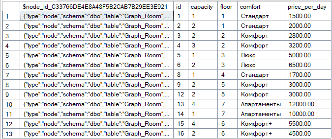
  <li>Найти клиентов, выехавших из номера раньше срока, указанного в договоре</li>
<pre><code>
SELECT DISTINCT
    c.full_name AS ФИО,
    c.passport AS Паспорт,
    s.checkin_date AS Дата_заселения,
    s.actual_checkout AS Фактический_выезд,
    DATEADD(DAY, ROUND(s.preliminary_cost / r.price_per_day, 0), s.checkin_date) AS Плановый_выезд,
    DATEDIFF(DAY, s.actual_checkout,DATEADD(DAY, ROUND(s.preliminary_cost / r.price_per_day, 0), s.checkin_date)
    ) AS Дней_раньше_срока
FROM 
    Graph_Client c,
    Graph_Booking b,
    Graph_Room r,
    Graph_Stay s,
    HAS_BOOKING hb,
    INCLUDES_ROOM ir,
    STAYS_IN si
WHERE 
    -- Клиент -> Бронирование -> Номер
    MATCH(c-(hb)->b-(ir)->r)
    -- Заселение -> Номер
    AND MATCH(s-(si)->r)
    AND c.id = s.client_id
    AND s.actual_checkout IS NOT NULL  -- только завершенные заселения
    AND s.checkin_date IS NOT NULL
    -- расчет планового выезда на основе предварительной стоимости и цены номера
    AND s.actual_checkout < DATEADD(DAY, ROUND(s.preliminary_cost / r.price_per_day, 0),s.checkin_date)
ORDER BY Дней_раньше_срока DESC;
</code></pre>
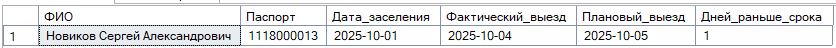
  <li>Найти номера, которые ни разу не сдавались с начала текущего года:</li>
<pre><code>
SELECT DISTINCT r.id AS Номер_ID, 
       r.comfort AS Комфортность,
       r.capacity AS Вместимость,
       r.floor AS Этаж,
       r.price_per_day AS Цена_сутки
FROM Graph_Room r
WHERE NOT EXISTS (
    -- проверка не сдавался с начала года
    SELECT 1
    FROM Graph_Stay s, STAYS_IN si
    WHERE MATCH(s-(si)->r) -- заселение -> номер
      AND s.checkin_date >= '2025-01-01'
)
AND NOT EXISTS (
    -- не забронирован и нет в активных бронях
    SELECT 1
    FROM Graph_Booking b, INCLUDES_ROOM ir
    WHERE MATCH(b-(ir)->r) -- бронирование -> номер
      AND b.status IN ('создана', 'завершена')
)
ORDER BY r.id;
</code></pre>
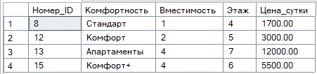
  <li>Найти клиентов, забронировавших номер, но так и не въехавших в него:</li>
<pre><code>
-- Клиенты с бронированием, но без соответствующего заселения
SELECT DISTINCT
    c.id AS Клиент_ID,
    c.full_name AS ФИО,
    b.id AS Бронь_ID,
    b.expected_checkin AS Дата_предположительного_заселения,
    b.status AS Статус
FROM Graph_Client c, HAS_BOOKING hb, Graph_Booking b
WHERE MATCH(c-(hb)->b)  -- Клиент -> Бронирование
  AND b.status IN ('создана', 'завершена')
  AND NOT EXISTS (
    -- есть ли заселение для этого клиента с тем же номером, что и в брони
    SELECT 1
    FROM Graph_Stay s, STAYS_IN si, Graph_Room r, INCLUDES_ROOM ir
    WHERE MATCH(s-(si)->r)  -- Заселение -> Номер
      AND MATCH(b-(ir)->r)  -- Бронь -> Тот же номер
      AND s.client_id = c.id  -- заселение того же клиента
  )
ORDER BY c.full_name;
</code></pre>
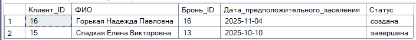
  <li>Среди всех клиентов, наиболее часто пользующихся услугами гостиницы, найти клиентов с максимальным сроком проживания:</li>
<pre><code>
-- частые услуги
WITH ЧастыеПользователиУслуг AS (
    SELECT 
        c.id AS client_id,
        c.full_name AS ФИО,
        COUNT(DISTINCT sv.id) AS количество_услуг
    FROM Graph_Client c
    -- Клиент -> Бронирование
    JOIN HAS_BOOKING hb ON c.$node_id = hb.$from_id
    JOIN Graph_Booking b ON hb.$to_id = b.$node_id
    -- cвязь к заселению по client_id
    JOIN Graph_Stay s ON s.client_id = c.id
    -- Заселение -> Услуга
    JOIN HAS_SERVICE hs ON s.$node_id = hs.$from_id
    JOIN Graph_Service sv ON hs.$to_id = sv.$node_id
    GROUP BY c.id, c.full_name
    -- минимум 2 уникальные услуги
    HAVING COUNT(DISTINCT sv.id) >= 2
),

-- срок проживания для заверешенных
СрокиПроживания AS (
    SELECT 
        c.id AS client_id,
        c.full_name AS ФИО,
        s.id AS stay_id,
        s.checkin_date AS дата_заселения,
        s.actual_checkout AS дата_выезда,
        -- расчет количества дней проживания
        DATEDIFF(DAY, s.checkin_date, s.actual_checkout) AS дней_проживания
    FROM Graph_Client c
    -- связь с бронированием
    JOIN HAS_BOOKING hb ON c.$node_id = hb.$from_id
    JOIN Graph_Booking b ON hb.$to_id = b.$node_id
    -- основная связь: клиент и его заселения
    JOIN Graph_Stay s ON s.client_id = c.id
    -- только завершенные заселения
    WHERE s.checkin_date IS NOT NULL
      AND s.actual_checkout IS NOT NULL
)

-- основной запрос
SELECT 
    c.id AS Клиент_ID,
    c.full_name AS ФИО,
    -- макс срок проживания клиента
    MAX(sp.дней_проживания) AS Максимальный_срок_проживания,
    cpu.количество_услуг AS Количество_использованных_услуг
FROM Graph_Client c
JOIN ЧастыеПользователиУслуг cpu ON c.id = cpu.client_id
JOIN СрокиПроживания sp ON c.id = sp.client_id
GROUP BY c.id, c.full_name, cpu.количество_услуг
-- только клиенты с макс сроком среди всех частых пользователей услуг
HAVING MAX(sp.дней_проживания) = (
    SELECT MAX(sp2.дней_проживания) 
    FROM СрокиПроживания sp2 
    WHERE sp2.client_id IN (SELECT client_id FROM ЧастыеПользователиУслуг)
)
ORDER BY Максимальный_срок_проживания DESC;
</code></pre>
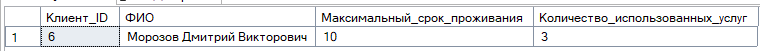
</ol>
</div>


