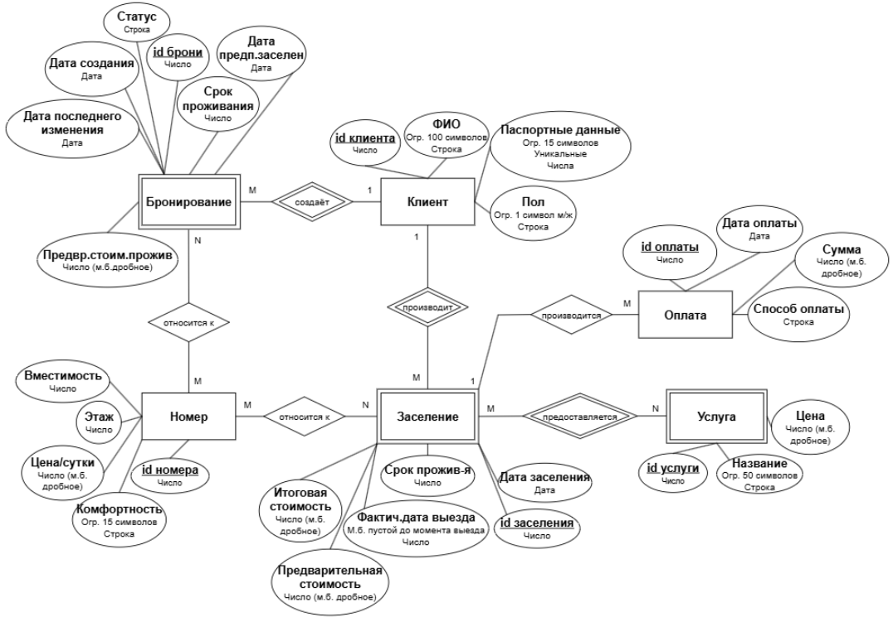
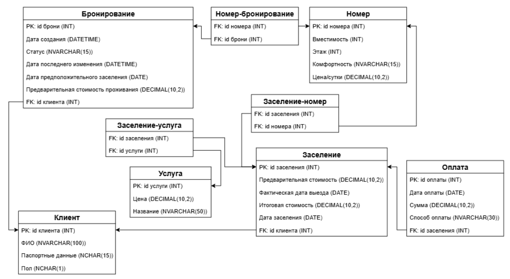

<h1 name="content" align="center"> MSSQL</h1>

   

# Лабораторная № 1

[Назад](#content)
<h3 align="center">
  
  Разработать ER-модель данной предметной области: выделить сущности, их атрибуты, связи между сущностями. 
Для каждой сущности указать ее имя, атрибут (или набор атрибутов), являющийся первичным ключом, список остальных атрибутов.
Для каждого атрибута указать его тип, ограничения, может ли он быть пустым, является ли он первичным ключом.
Для каждой связи между сущностями указать: 
- тип связи (1:1, 1:M, M:N)
- обязательность

ER-модель д.б. представлена в виде ER-диаграммы (картинка)

По имеющейся ER-модели создать реляционную модель данных и отобразить ее в виде списка сущностей с их атрибутами и типами атрибутов,  для атрибутов указать, явл. ли он первичным или внешним ключом 
</h3>

#### №1. ER-модель

#### №1.1. Реляционная модель

